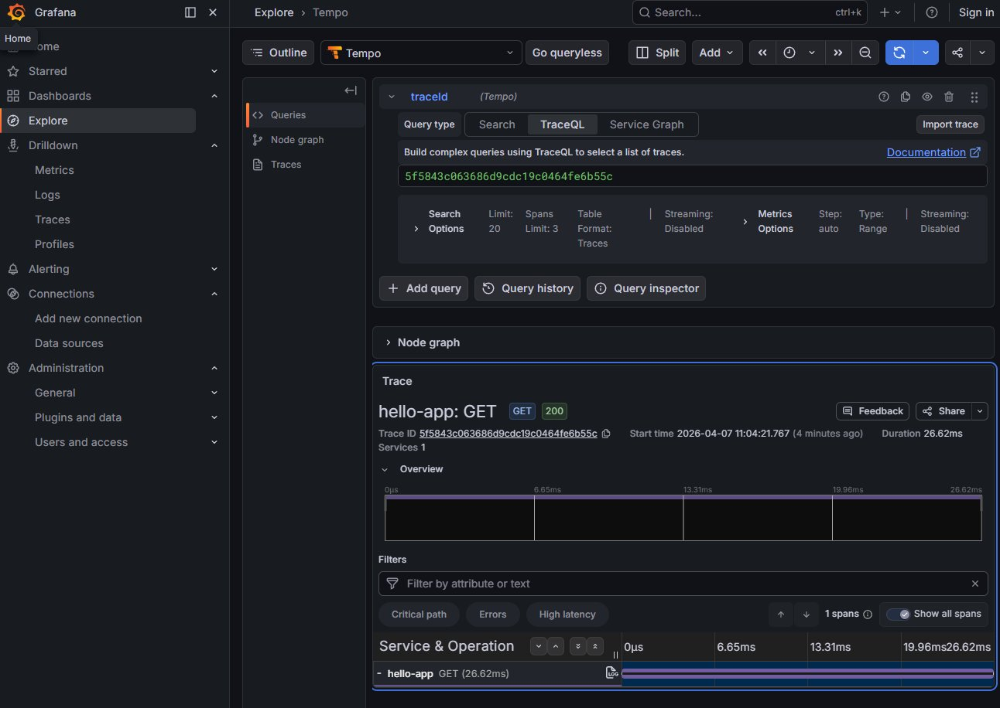
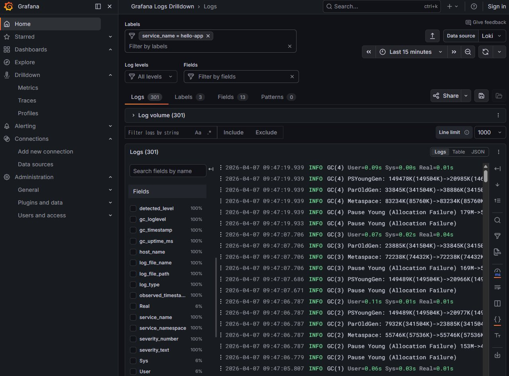
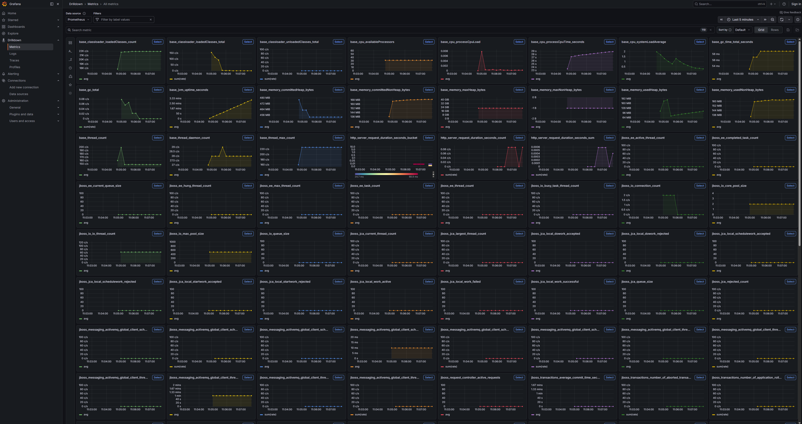
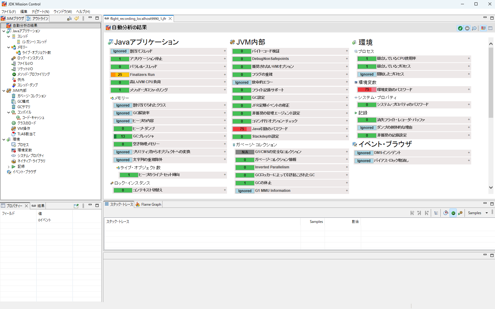
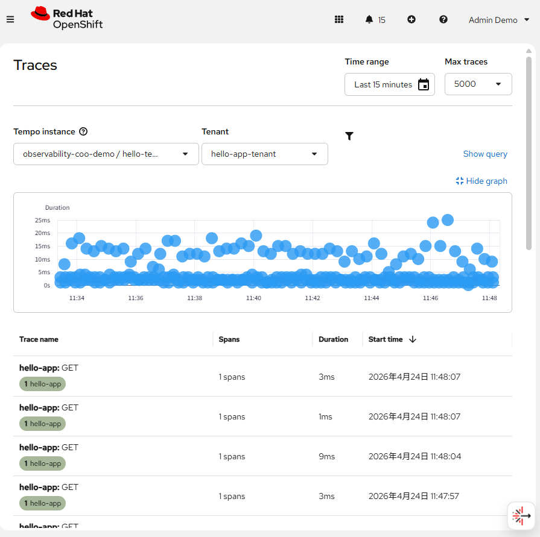
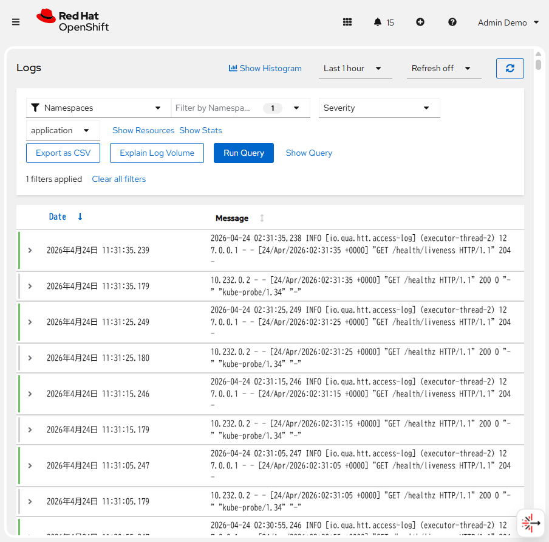
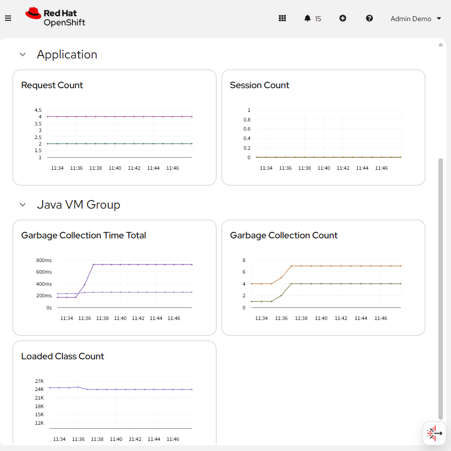
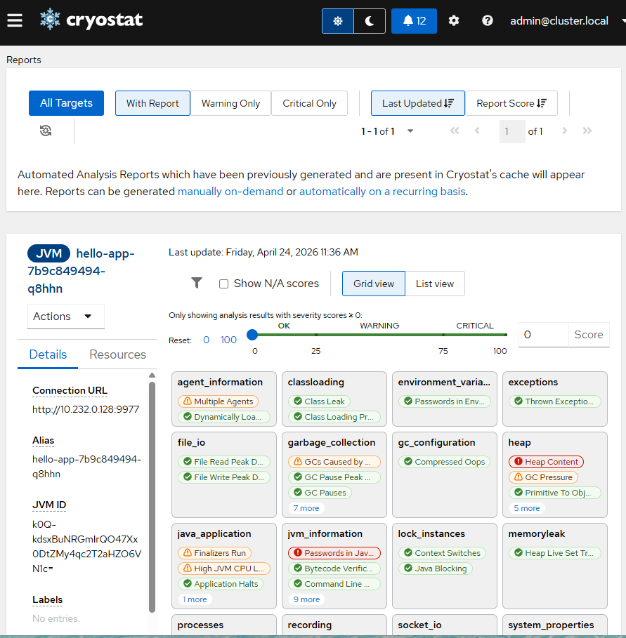

# JBoss EAP Observability Demo

このデモは、JBoss EAP 8.1 を使って Observability をデモするためのサンプルです。  

以下の2つ構成を用意しています。

- JBoss EAP 単体の構成
- JBoss EAP 8.1 + XP 6.0 

JBoss EAP 単体の構成では、アプリケーションサーバが標準で提供する Observability 情報を確認できます。  
JBoss EAP 8.1 + XP 6.0 の構成では、単体の構成に加えて、アプリケーション開発者がメトリクスやスパンを追加した場合の動作も確認できます。

このデモは、以下の環境にデプロイできます。
- Podman Compose
- OpenShift Container Platform (以下 OpenShift)
- OpenShift Container Platform + Cluster Observability Operator　(以下 COO)

Podman Composeは、JBoss EAP単体と、XPを含んだ構成をデプロイできます。
OpenShiftは、JBoss EAP単体のみをデプロイできます。

OpenShiftは、4.21で動作を確認しています。

## UI
UIの違い
- Podman Compose版とOpenShift版は、UI に Grafana を使っています。
- COO版は、UI に Cluster Observability Operator を使っています。

### GrafanaのUI






### COOのUI






## 想定している使い方

このデモは、次のような目的で利用できます。

* JBoss EAP における Observability の基本動作を確認する
* JBoss EAP 単体構成と XP 追加構成の違いを比較する
* アプリケーションサーバが提供する情報と、アプリケーション開発者が追加する情報の違いを確認する
* Podman Compose 上で手元ですばやく動作確認する
* OpenShift 上で動作確認する
* OpenShift の Cluster Observability Operatorで動作確認する

## このデモで確認できること

アプリケーションは、REST APIとリンク集を提供しています。
リンク集から、各種Observabilityのツールへアクセスできます。
アプリケションをデプロイ後は、そのアプリケーションのホストへアクセスしてください。
トップページがリンク集になっています。

このデモでは、以下の Observability 機能を扱います。

- Health Check
- Metrics
- Tracing
- Log
- Profiling

各機能の実装方針は次のとおりです。

- **Health Check**  
  Eclipse MicroProfile Health を利用します。

- **Metrics**  
  JBoss EAP 単体の構成では Eclipse MicroProfile Metrics を利用します。  
  JBoss EAP 8.1 + XP 6.0 の構成では Micrometer を利用します。

- **Tracing**  
  OpenTelemetry を利用します。  
  JBoss EAP 単体の構成では Java Agent として OpenTelemetry をサーバに追加します。  
  JBoss EAP 8.1 + XP 6.0 の構成では、XP が提供する機能を利用します。
  OpenShiftの構成では、OTel Instrumentationを利用します。

- **Log**  
  Unified JVM Logging により GC ログを取得します。

- **Profiling**  
  JDK Flight Recorder を利用します。
  OpenShiftの構成では、Cryostat Agentを利用します。

## 構成の違い

### JBoss EAP 8.1 単体
この構成では、主にアプリケーションサーバ自身が提供する情報を確認できます。  
追加のアプリケーション実装なしで、サーバ側の Health Check、Metrics、Tracing、Log、Profiling を観察するための構成です。

### JBoss EAP 8.1 + XP 6.0
この構成では、アプリケーションサーバが提供する情報に加えて、開発者がアプリケーションコードからメトリクスやスパンを追加できます。  
そのため、サーバ観点だけでなく、アプリケーション観点の Observability を確認したい場合に適しています。

## デプロイ方法

このデモは、以下の方法で実行できます。

- Podman Compose
- OpenShift Container Platform
- OpenShift Container Platform Plus 

## Podman Compose で実行する

### JBoss EAP 8.1 on Podman Compose

JBoss EAP 単体の構成を起動する場合は、以下を実行します。

```shell
podman compose up -d
````

停止する場合は以下を実行します。

```shell
podman compose down
```

### JBoss EAP 8.1 + XP 6.0 on Podman Compose

JBoss EAP 8.1 + XP 6.0 の構成を起動する場合は、以下を実行します。

```shell
podman compose -f docker-compose-xp.yaml up -d
```

停止する場合は以下を実行します。

```shell
podman compose -f docker-compose-xp.yaml down
```

## アクセス先

Podman Compose でデプロイした場合、アプリケーションには以下の URL でリンク集へアクセスできます。

* [http://localhost:8080](http://localhost:8080)

## OpenShift で実行する

このデモは OpenShift にデプロイして実行できます。
OpenShift Container Platform版は、UIに Grafana を使用します。
Cluster Observability Operator (COO) 版は、UIに COO を使用します。

デプロイには`oc`コマンドが必要です。

OpenShift Container Platform版は以下のようにインストールします。
```shell
./prepDemo.sh
./installOpenshiftDemo.sh
```

Cluster Observability Operator (COO) 版は以下のようにインストールします。
```shell
./prepDemo.sh
./installCooDemo.sh
```

アプリケーションのRouteである`hello-app-route`へアクセスするとリンク集へアクセスできます。

## 補足

JBoss EAP 単体構成と XP 追加構成では、利用する仕様や実装方法が一部異なります。
特に Metrics と Tracing は構成によって使用技術が異なるため、どの構成で何を確認したいのかを意識して使い分けてください。
